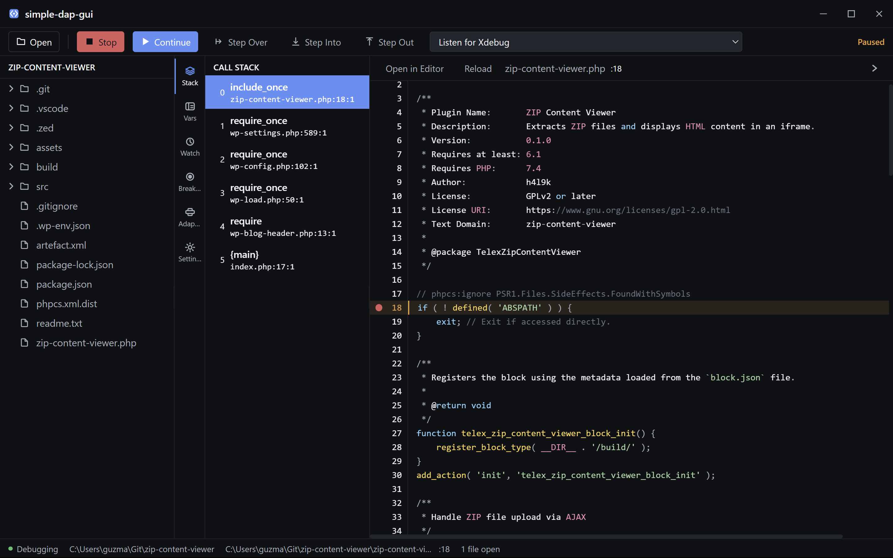
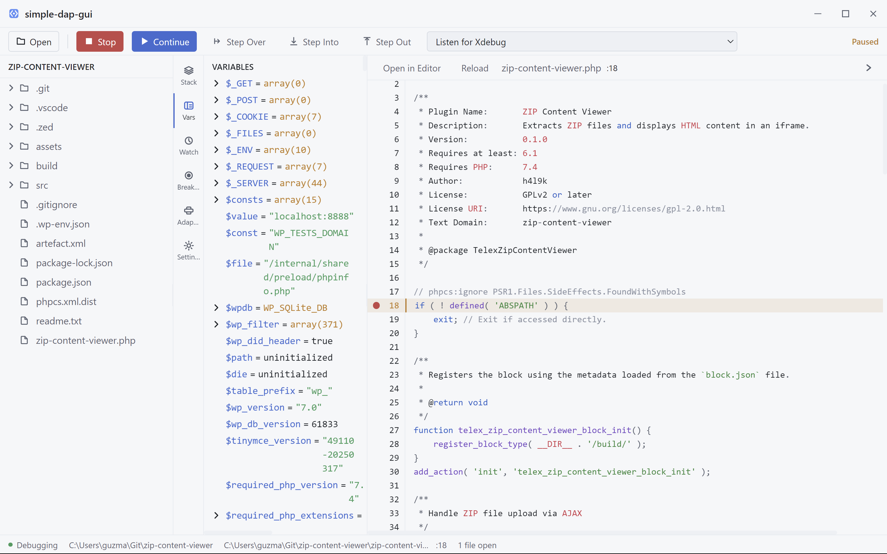
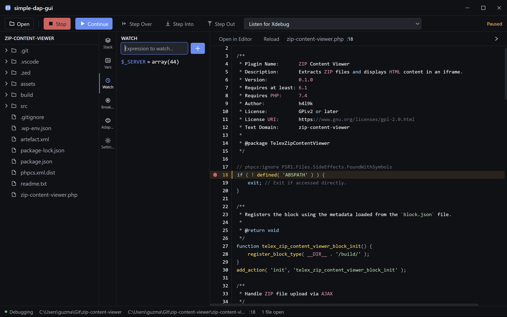
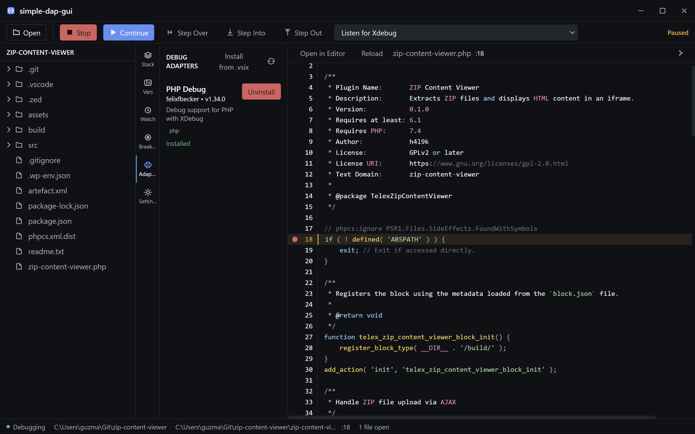

# simple-dap-gui - Xdebug Debugger GUI

[](https://github.com/guzmandrade-dev/simple-dap-gui/actions/workflows/build.yml)
[](https://opensource.org/licenses/MIT)
[](https://github.com/guzmandrade-dev/simple-dap-gui/releases)

A standalone DAP (Debug Adapter Protocol) client GUI application built with Electron, React, TypeScript, and PrismJS. Primarily designed for **PHP debugging with Xdebug**.

## Features

- **Xdebug / PHP Focus**: First-class support for PHP debugging via the `vscode-php-debug` adapter
- **PrismJS Code Viewer**: Lightweight, read-only code viewer with syntax highlighting and breakpoint gutter support
- **Path Mapping**: Full support for remote debugging with `${workspaceFolder}` resolution in path mappings
- **Persistent Breakpoints**: Optional setting to save and restore breakpoints across sessions
- **Call Stack View**: Navigate through the call stack during debugging — click any frame to jump to its source
- **Variables Panel**: Inspect variables at different scopes with expandable children
- **Watch Panel**: Evaluate and monitor custom expressions while debugging
- **Dark/Light Theme**: Toggle between dark and light editor themes via settings
- **Debug Adapter Management**: Built-in manager to install/uninstall DAP adapters (custom .vsix install supported)
- **App Logo & Icons**: Simple code-brackets SVG brand mark, generated as PNG/ICO assets for all platforms
- **Workspace Integration**: Open workspace directly in your preferred external editor
- **Current Line Highlight**: The active execution line is highlighted with a theme-aware color in both the gutter and the code view
- **Monochrome Tool UI**: Flat, borderless chrome with a single accent color and monochrome SVG icons
- **Keyboard Shortcuts**: Standard debug shortcuts (F5, F10, F11, Shift+F5, Shift+F11)

## Screenshots

### Breakpoint Gutter (Dark Theme)
Click the gutter to toggle breakpoints. The current execution line is highlighted in yellow.



### Breakpoint Gutter (Light Theme)
The same view in light mode.



### Watch Panel
Monitor custom expressions as you step through code.



### Adapter Manager
Install, uninstall, and manage DAP adapters from the built-in catalog.



## Project Structure

```
dap-gui/
├── electron/              # Electron main process
│   ├── main.ts           # Entry point
│   └── preload.ts        # Preload script for IPC
├── src/
│   ├── dap/              # DAP protocol implementation
│   │   ├── client.ts     # DAP client with protocol parser
│   │   ├── session.ts    # Debug session management
│   │   └── types.ts      # TypeScript type definitions
│   ├── components/       # React components
│   │   ├── Editor/       # PrismJS code viewer
│   │   ├── FileExplorer/ # Workspace file tree with lazy loading
│   │   ├── Panels/       # Side panels (stack, variables, watch, breakpoints, settings, adapters)
│   │   ├── Toolbar/      # Debug controls
│   │   └── StatusBar/    # Status bar
│   ├── styles/           # Theme CSS (dark/light) with CSS custom properties
│   ├── stores/           # Zustand state stores
│   └── utils/            # Helper utilities
└── ...
```

## Installation

### Package managers (recommended)

Once published, install the app through your platform's package manager:

- **Windows (Winget)**: `winget install guzmandrade-dev.simple-dap-gui`
- **macOS (Homebrew)**: `brew install --cask simple-dap-gui`
- **Linux (Flatpak/Flathub)**: `flatpak install flathub com.guzmandrade.SimpleDapGui`

Releases are published automatically from GitHub Releases via:
- [`.github/workflows/winget.yml`](.github/workflows/winget.yml)
- [`.github/workflows/homebrew-cask.yml`](.github/workflows/homebrew-cask.yml)
- `distrib/flathub/com.guzmandrade.SimpleDapGui.yml` (submit to [flathub/flathub](https://github.com/flathub/flathub))

### From source

```bash
# Install dependencies
npm install

# For PHP debugging, install the PHP debug adapter:
# Option 1: Download from GitHub releases
# https://github.com/xdebug/vscode-php-debug/releases

# Option 2: Clone and build
git clone https://github.com/xdebug/vscode-php-debug.git
cd vscode-php-debug
npm install
npm run build
# Copy out/ folder to your project
```

## Usage

1. **Create a launch.json** in your project's `.vscode/` folder:

```json
{
  "version": "0.2.0",
  "configurations": [
    {
      "name": "Listen for XDebug",
      "type": "php",
      "request": "launch",
      "port": 9003,
      "pathMappings": {
        "/var/www/html": "${workspaceFolder}"
      }
    }
  ]
}
```

2. **Start the application**:
```bash
npm run dev
```

3. **Select a configuration** from the dropdown in the toolbar

4. **Click Debug** (or press **F5**) to start debugging

5. **Set breakpoints** by clicking in the gutter area

6. **Toggle Theme** between dark and light via the Settings panel

## Keyboard Shortcuts

| Shortcut | Action |
|----------|--------|
| **F5** | Start Debugging / Continue |
| **Shift + F5** | Stop Debugging |
| **F10** | Step Over |
| **F11** | Step Into |
| **Shift + F11** | Step Out |

## Panels

### Variables
Inspect local and global variables at the current stack frame. Expand arrays and objects to view their children.

### Watch
Add custom expressions (e.g., `$myVariable`, `$_SERVER['REQUEST_URI']`) to monitor their values as you step through code. Watches are re-evaluated automatically on every stop.

### Call Stack
Navigate between stack frames to inspect variables at different levels of execution. Click any frame to jump directly to its source file and line in the editor.

### Breakpoints
View and manage all breakpoints set across the workspace. Enable **Persistent Breakpoints** in Settings to save them to `.vscode/dap-gui.breakpoints.json` and restore them on the next session.

### Adapters
Install, uninstall, and manage DAP adapters. The built-in catalog currently lists the **PHP Debug** adapter. You can also install any adapter from a `.vsix` file.

## External Editor Integration

Configure your preferred editor in the **Settings** panel:
- **VS Code** (default): `code`
- **Zed**: `zed`
- **Vim** (terminal): `vim`
- **Custom command** with argument templates (`{file}`, `{line}`)

Use **"Open Workspace in Editor"** to open the current workspace root directly. External editor commands are resolved against your PATH (`where` on Windows, `which` on macOS/Linux) with a fallback to common install locations.

## Collapsible Layout

Click the **→** arrow in the editor header to collapse the editor panel. This gives the file explorer and debug panels more room. When collapsed:
- The file explorer and sidebar share the available space
- You can still resize the split between them
- Click any file in the explorer to auto-expand the editor
- Use the **←** button on the far right to restore the editor

## Theme & Appearance

The app supports dark and light themes via CSS custom properties mapped to Tailwind's semantic color tokens (`bg-panel`, `text-accent`, `border-danger`, etc.). Themes are persisted to `localStorage` and switch instantly across the UI and PrismJS code viewer.

## Debug Adapter Management

Install or uninstall DAP adapters from the **Adapters** panel. The manager tracks installed adapters, their paths, and supported languages.

### Current Focus
- **PHP**: `vscode-php-debug` — primary and tested adapter

### Roadmap
Future versions may expand first-class support to:
- **Python**: `debugpy`
- **Node.js**: Built-in DAP support
- **C/C++**: `vscode-cpptools`

In the meantime, any DAP-compatible adapter can be installed manually via the **Install from .vsix** button.

## Development

```bash
# Run in development mode with hot reload
npm run dev

# Build for production
npm run build

# Preview production build
npm run preview
```

## Path Mapping

The application supports path mappings for remote debugging. Configure them in your `launch.json`:

```json
"pathMappings": {
  "/server/path": "${workspaceFolder}/local/path"
}
```

`${workspaceFolder}` is automatically resolved to the current workspace root, so breakpoints and stack traces map correctly between server and local paths.

## Persistent Breakpoints

By default, breakpoints are kept in memory only. To save them across sessions:

1. Open the **Settings** panel
2. Check **Persistent Breakpoints**
3. Breakpoints are saved to `.vscode/dap-gui.breakpoints.json` in your workspace
4. On the next project open, they are restored automatically

## File Reload

The code viewer always loads the latest file content from disk when you open a file. If you edit a file in an external editor while it's already open, click the **Reload** button in the editor toolbar to refresh the content.

## Troubleshooting

- **Adapter not found**: Make sure to install the appropriate debug adapter for your language
- **Breakpoints not hit**: Check path mappings configuration. Paths that contain `${workspaceFolder}` are resolved against the opened workspace root.
- **External editor not found**: Make sure the editor is on your PATH, or use the full path in the Custom editor setting

## License

MIT
